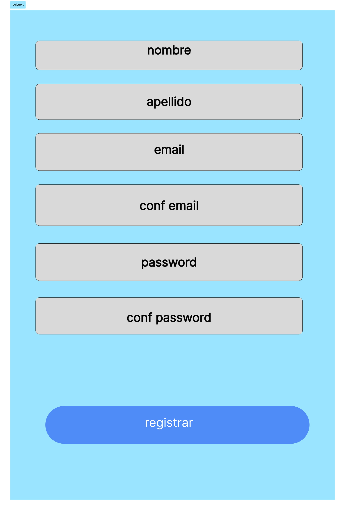
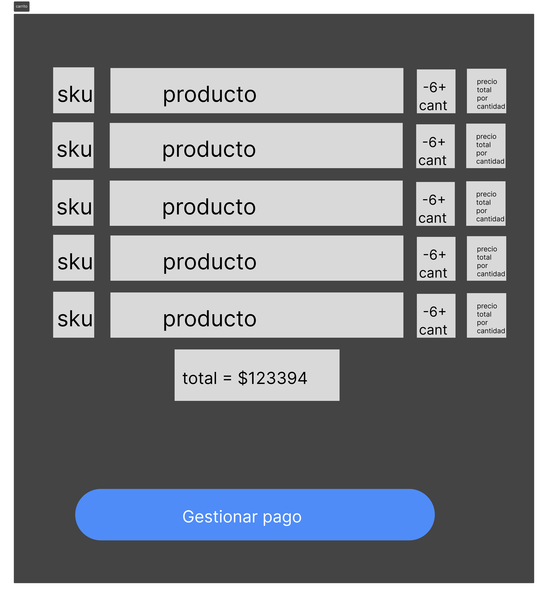
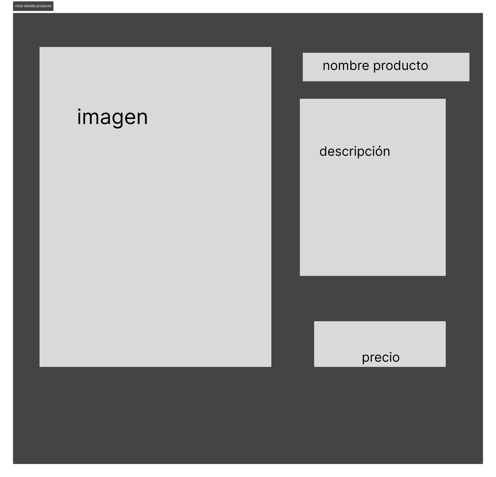
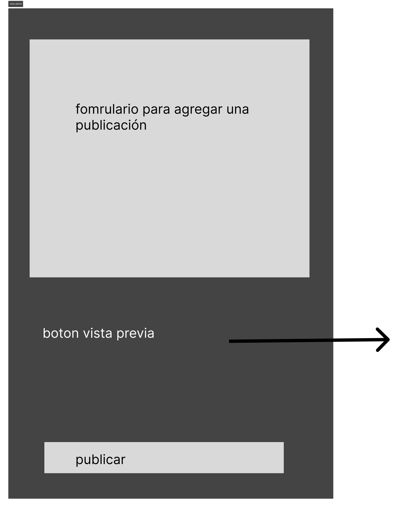
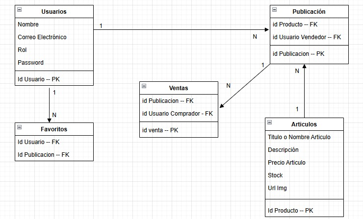

# FrioRojas - Plataforma de E-commerce

## Descripción
FrioRojas es una plataforma de comercio electrónico especializada en productos de refrigeración con servicio de despacho a todo Chile. El sitio ofrece un catálogo completo de productos, sistema de autenticación de usuarios, carrito de compras y gestión de productos.

## Características Principales
- Sistema de autenticación y registro de usuarios
  
- Carrito de compras
    
- Vista detallada de productos
    
- Sistema de publicación de productos
  

## Dependecias de desarrollo

### Frontend
- React
- Bootstrap
- React Bootstrap
- React Router DOM
- Zustand

### Backend
- Express.js
- PostgreSQL
- JSON Web Tokens
- bcrypt
- CORS
- pg
- pg-format

## Estructura de la Base de Datos

  

### Tablas
- Usuarios
  - ID Usuario (PK)
  - Nombre
  - Correo Electrónico
  - Rol
  - Contraseña

- Artículos
  - ID Producto (PK)
  - Título/Nombre
  - Descripción
  - Precio
  - Stock
  - URL de Imagen

- Publicaciones
  - ID Publicación (PK)
  - ID Producto (FK)
  - ID Usuario Vendedor (FK)

- Ventas
  - ID Venta (PK)
  - ID Publicación (FK)
  - ID Usuario Comprador (FK)

- Favoritos
  - ID Usuario (FK)
  - ID Publicación (FK)

## Endpoints de la API

### Autenticación
- POST /login
- POST /register

### Productos
- GET /usuarios
- GET /publicaciones
- GET /publicaciones/:id
- POST /articulos
- POST /publicacion

### Ventas
- GET /ventas/:id
- POST /ventas

### Favoritos
- GET /favoritos/:id

## Secciones de la Interfaz

### Sección Pública
- Página Principal
- Registro de Usuarios
- Inicio de Sesión
- Galería de Productos
- Detalles de Productos

### Sección Privada
- Perfil de Usuario
- Carrito de Compras
- Formulario de Carga de Productos
- Lista de Favoritos

## Características de Seguridad
- Autenticación basada en JWT
- Encriptación de contraseñas con bcrypt
- Rutas protegidas
- Control de acceso basado en roles

## Dependencias Principales
### Frontend
- bootstrap
- react
- react-bootstrap
- react-dom
- react-router-dom
- zustand

### Backend
- express.js
- jsonwebtoken
- bcrypt
- cors
- pg
- pg-format
